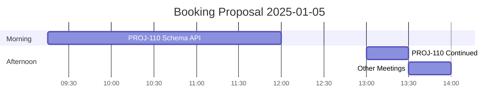

**Arguments:** `$ARGUMENTS` (Format: `[period]`)

**Parameter Defaults:**
- `period`: today (if empty)

## Skill References

Load these skills for details:
- **`time-tracking-csv`** - CSV format, field definitions, booking configuration
- **`time-tracking-booking`** - Booking proposals, daily accumulation, value-oriented descriptions
- **`time-tracking-reports`** - Report storage, HTML styling, browser integration

## Task

Execute these steps in order:

### 1. Parse the period argument

Interpret `$ARGUMENTS`:

| Input | Meaning | Calculation |
|-------|---------|-------------|
| (empty) | Today | `date +"%Y-%m-%d"` |
| `today` | Today | `date +"%Y-%m-%d"` |
| `yesterday` | Yesterday | `date -v-1d +"%Y-%m-%d"` |
| `YYYY-MM-DD` | Single day | Use directly |
| `YYYY-MM-DD YYYY-MM-DD` | Range (max 7 days) | Start and end date |
| `week` | Current week | Monday to Sunday (7 days) |

**Validation:**
- Range > 7 days: Error "Maximum 7 days. Please choose a shorter period."
- End date before start date: Error "End date must be after start date."

### 2. Read the configuration

Read `.opencode/opencode-project.json`:

```json
{
  "time_tracking": {
    "csv_file": "~/time_tracking/time-tracking.csv",
    "charts_dir": "~/time_tracking/charts/",
    "reports_dir": "~/time_tracking/reports/",
    "booking": {
      "rounding_minutes": 5,
      "lunch_break": {
        "start": "12:00",
        "end": "13:00"
      }
    },
    "pricing": { ... }
  }
}
```

**Defaults:**
- `charts_dir`: `~/time_tracking/charts/`
- `reports_dir`: `~/time_tracking/reports/`
- `booking.rounding_minutes`: `5`
- `booking.lunch_break.start`: `"12:00"`
- `booking.lunch_break.end`: `"13:00"`

**Validation:**
- If `time_tracking` missing: "Please run `/time-tracking.init` first"
- If `pricing` missing: Warning, skip cost calculation

### 3. Parse and filter the CSV data

**IMPORTANT:** All CSV fields are quoted. Remove quotes when parsing!

```bash
# Example: Filter by date with quote handling
awk -F',' '
  NR > 1 {
    for (i=1; i<=NF; i++) gsub(/"/, "", $i)  # Remove quotes
    if ($2 == "YYYY-MM-DD") print $8, $9, $10, $11, $6, $14, $16
  }
' ~/time_tracking/time-tracking.csv
```

1. Read CSV file (skip header, NR > 1)
2. **Remove quotes from all fields** (`gsub(/"/, "", $i)`)
3. Filter entries by `start_date` (column 2)
4. Sort by `start_date` + `start_time`
5. Extract fields: `start_date` ($2), `start_time` ($8), `end_time` ($9), `duration_seconds` ($10), `tokens_used` ($11), `issue_key` ($6), `description` ($14), `model` ($16)

### 4. Apply rounding and consolidation

See skill `time-tracking-csv`:
1. Round times to 5-minute precision
2. Round duration to 5-minute units
3. Consolidate sequential entries (same ticket, directly consecutive)

### 5. Generate booking proposal (single day only)

See skill `time-tracking-booking` for details.

**Algorithm:**
1. ACCUMULATE per ticket (all entries with same `issue_key`)
2. ROUND booking duration to `booking.rounding_minutes` (round up, default: 5)
3. SORT by first activity
4. START TIME: Earliest activity, rounded down to `booking.rounding_minutes`
5. FILL TIME BLOCKS sequentially (respect `booking.lunch_break` settings)
6. DESCRIPTION: Generate value-oriented summary (max 80 characters)

**Core principle:** Maximum one booking per ticket per day.

**Note:** Rounding is configured in `booking.rounding_minutes`, not as a command argument.

### 6. Calculate totals and token statistics

1. Calculate hours per day and per ticket
2. Sum tokens and format them (K for thousands, M for millions)
3. Calculate efficiency as tokens per hour
4. Calculate costs if pricing is configured

### 7. Generate diagrams

Use `mermaid-file-server` MCP:

| Period | Gantt (Entries) | Gantt (Booking) | Pie (Time) | Pie (Tokens) | Bar |
|--------|-----------------|-----------------|------------|--------------|-----|
| 1 day | Yes | Yes | Yes | Yes | No |
| 2-7 days | No | No | Yes | Yes | Yes |

Save to `charts_dir` with format: `timesheet-{date}-{timestamp}-{type}.png`

### 8. Create the output

**Single day:**
1. Create header with period and entry count
2. Create entries table (Time, Duration, Ticket, Description)
3. Create booking proposal table (Ticket, From, To, Duration, Raw, Tokens, Description)
4. Show totals per ticket
5. Show token statistics
6. Embed the generated diagrams

**Range (2-7 days):**
1. Create header with period
2. Create matrix table (hours per ticket per day)
3. Show token statistics
4. Embed the generated diagrams

### 9. Save reports and open in browser

See skill `time-tracking-reports`:
1. Save Markdown to `reports_dir`
2. Generate HTML with CSS styling
3. Open browser

---

## Output Formats

### Booking Proposal Table (Single Day)

```markdown
| Ticket | From | To | Duration | Raw | Tokens | Description |
|--------|------|-----|----------|-----|--------|-------------|
| PROJ-110 | 09:15 | 12:00 | 2.75h | 2.28h | 180K | Implemented schema and admin API |
| PROJ-110 | 13:00 | 13:30 | 0.50h | | | (Continued) Schema and admin API |
| - | 13:30 | 14:00 | 0.50h | 0.42h | 31K | Team meetings and coordination |
```

**For continuation (lunch break):** Raw and Tokens empty, Description: `(Continued) ...`

### Matrix Table (Range)

```markdown
| Ticket | Mon 06 | Tue 07 | Wed 08 | Hours | Tokens | ~Cost |
|--------|--------|--------|--------|-------|--------|-------|
| PROJ-110 | 2.50 | 4.00 | 1.50 | 8.00 | 5.2M | ~$140 |
| **Total** | **4.00** | **6.00** | **4.00** | **14.00** | **8.1M** | **~$218** |
```

### Gantt Booking Proposal

**IMPORTANT:** For correct time axis display:
- `dateFormat YYYY-MM-DD HH:mm` - full date+time for the data
- `axisFormat %H:%M` - only time on the X-axis



---

## Important Notes

- **Only read time-tracking.csv** (not worklogs-sync.csv)
- **Maximum 7 days** per query
- **Booking proposal only for single day**
- **Diagrams optional:** If mermaid-file-server unavailable → tables only
- **Create directories:** If not exists, create automatically
- **Open browser:** Automatically after report generation
