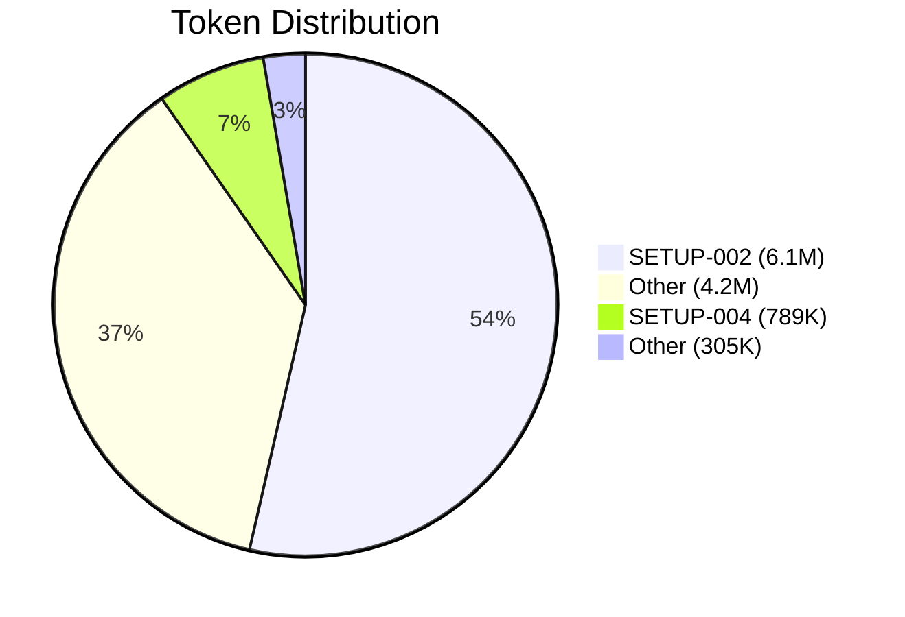

# Time Tracking Reports

## Overview

This skill defines the report format, HTML styling, token statistics, cost calculation, and browser integration for timesheet reports. It is referenced by the `/time-tracking.timesheet` command.

## When to Use This Skill

- `/time-tracking.timesheet` with report saving
- Manual report generation
- HTML export for presentations
- Token cost analysis
- API cost reporting

## Configuration

Configuration is read from `.opencode/opencode-project.json`:

```json
{
  "time_tracking": {
    "csv_file": ".opencode/time_tracking/time-tracking.csv",
    "charts_dir": ".opencode/time_tracking/charts/",
    "reports_dir": ".opencode/time_tracking/reports/"
  }
}
```

| Field | Description | Required | Default |
|-------|-------------|----------|---------|
| `reports_dir` | Directory for reports | No | `.opencode/time_tracking/reports/` |
| `charts_dir` | Directory for charts | No | `.opencode/time_tracking/charts/` |

If configuration is missing, inform user: "Please run `/time-tracking.init`"

## File Structure

```
.opencode/time_tracking/
├── time-tracking.csv          # Main CSV
├── charts/                    # Generated charts
│   ├── timesheet-2025-01-06-143052-gantt.png
│   └── timesheet-2025-01-06-143052-pie.png
└── reports/                   # Generated reports
    ├── timesheet-2025-01-06-143052.md
    └── timesheet-2025-01-06-143052.html
```

## Filename Format

**Schema:**
- Single day: `timesheet-{date}-{timestamp}.{ext}`
- Range: `timesheet-{start}-{end}-{timestamp}.{ext}`

**Examples:**
```
timesheet-2025-01-06-143052.md
timesheet-2025-01-06-143052.html
timesheet-2025-01-06-2025-01-10-143052.md
timesheet-2025-01-06-2025-01-10-143052.html
```

**Timestamp format:** `HHmmss` (e.g., `143052` = 14:30:52)

## Report Workflow

### 1. Save Markdown Report

The Markdown report contains:
- Header with time range and statistics
- Table(s) with entries
- Totals
- Image references (Markdown syntax)

```bash
# Create directory if not present
mkdir -p .opencode/time_tracking/reports/

# Save report
cat > .opencode/time_tracking/reports/timesheet-2025-01-06-143052.md << 'EOF'
## Timesheet: 2025-01-06

**Period:** Monday, January 6, 2025
...
EOF
```

### 2. Generate HTML Report

Convert Markdown to HTML with embedded CSS:

```bash
# Create HTML with CSS styling
cat > .opencode/time_tracking/reports/timesheet-2025-01-06-143052.html << 'EOF'
<!DOCTYPE html>
<html lang="en">
<head>
    <meta charset="UTF-8">
    <meta name="viewport" content="width=device-width, initial-scale=1.0">
    <title>Timesheet: 2025-01-06</title>
    <style>
        /* CSS embedded here */
    </style>
</head>
<body>
    <!-- Converted content -->
</body>
</html>
EOF
```

### 3. Open Browser

```bash
# macOS
open .opencode/time_tracking/reports/timesheet-2025-01-06-143052.html

# Linux
xdg-open .opencode/time_tracking/reports/timesheet-2025-01-06-143052.html
```

**Platform detection:**
```bash
if [[ "$OSTYPE" == "darwin"* ]]; then
    open "$html_file"
elif command -v xdg-open &> /dev/null; then
    xdg-open "$html_file"
else
    echo "Report saved: $html_file"
fi
```

## HTML Template

```html
<!DOCTYPE html>
<html lang="en">
<head>
    <meta charset="UTF-8">
    <meta name="viewport" content="width=device-width, initial-scale=1.0">
    <title>{{TITLE}}</title>
    <style>
        :root {
            --primary: #2563eb;
            --primary-light: #3b82f6;
            --gray-50: #f9fafb;
            --gray-100: #f3f4f6;
            --gray-200: #e5e7eb;
            --gray-300: #d1d5db;
            --gray-600: #4b5563;
            --gray-700: #374151;
            --gray-900: #111827;
        }
        
        * {
            margin: 0;
            padding: 0;
            box-sizing: border-box;
        }
        
        body {
            font-family: -apple-system, BlinkMacSystemFont, 'Segoe UI', Roboto, 'Helvetica Neue', Arial, sans-serif;
            line-height: 1.6;
            color: var(--gray-700);
            background: var(--gray-50);
            padding: 2rem;
            max-width: 1200px;
            margin: 0 auto;
        }
        
        h1, h2, h3 {
            color: var(--gray-900);
            margin-top: 1.5rem;
            margin-bottom: 0.75rem;
        }
        
        h1 {
            font-size: 1.875rem;
            border-bottom: 2px solid var(--primary);
            padding-bottom: 0.5rem;
        }
        
        h2 {
            font-size: 1.5rem;
            color: var(--primary);
        }
        
        h3 {
            font-size: 1.25rem;
        }
        
        p {
            margin-bottom: 1rem;
        }
        
        strong {
            color: var(--gray-900);
        }
        
        /* Tables */
        table {
            width: 100%;
            border-collapse: collapse;
            margin: 1rem 0 2rem 0;
            background: white;
            border-radius: 8px;
            overflow: hidden;
            box-shadow: 0 1px 3px rgba(0, 0, 0, 0.1);
        }
        
        th, td {
            padding: 0.75rem 1rem;
            text-align: left;
            border-bottom: 1px solid var(--gray-200);
        }
        
        th {
            background: var(--primary);
            color: white;
            font-weight: 600;
            text-transform: uppercase;
            font-size: 0.75rem;
            letter-spacing: 0.05em;
        }
        
        tr:hover {
            background: var(--gray-50);
        }
        
        tr:last-child td {
            border-bottom: none;
        }
        
        /* Right-align numbers */
        td:nth-child(2),
        td:nth-child(5),
        td:nth-child(6),
        td:nth-child(7) {
            text-align: right;
            font-variant-numeric: tabular-nums;
        }
        
        /* Bold for total rows */
        tr:last-child td {
            font-weight: 600;
            background: var(--gray-100);
        }
        
        /* Images */
        img {
            max-width: 100%;
            height: auto;
            border-radius: 8px;
            box-shadow: 0 4px 6px rgba(0, 0, 0, 0.1);
            margin: 1rem 0;
        }
        
        .chart-container {
            display: flex;
            flex-wrap: wrap;
            gap: 2rem;
            margin: 2rem 0;
        }
        
        .chart-container img {
            flex: 1 1 400px;
            max-width: 600px;
        }
        
        /* Header info */
        .meta {
            background: white;
            padding: 1rem 1.5rem;
            border-radius: 8px;
            margin-bottom: 2rem;
            box-shadow: 0 1px 3px rgba(0, 0, 0, 0.1);
        }
        
        .meta p {
            margin: 0.25rem 0;
        }
        
        /* Footer */
        footer {
            margin-top: 3rem;
            padding-top: 1rem;
            border-top: 1px solid var(--gray-200);
            color: var(--gray-600);
            font-size: 0.875rem;
        }
    </style>
</head>
<body>
    {{CONTENT}}
    <footer>
        Generated on {{GENERATED_AT}}
    </footer>
</body>
</html>
```

## Markdown to HTML Conversion

### Rules

1. **Headings:** `## Title` → `<h2>Title</h2>`
2. **Bold:** `**text**` → `<strong>text</strong>`
3. **Tables:** Markdown tables → HTML `<table>`
4. **Images:** `` → ``
5. **Paragraphs:** Empty line → `<p>` tags

### Image Paths

**Markdown Reports:** Use **relative paths** from reports directory:

```markdown
<!-- Reports are in .opencode/time_tracking/reports/, Charts in .opencode/time_tracking/charts/ -->


```

**HTML Reports:** Use **absolute paths** with `file://` protocol:

```html
<!-- Absolute with file:// (works in browsers) -->

```

**Path expansion for HTML:**
```bash
# Expand ~ to absolute path
charts_dir="${charts_dir/#\~/$HOME}"
# Result: /Users/username/time_tracking/charts/
```

**Directory structure:**
```
.opencode/time_tracking/
├── charts/           ← Generated charts
│   └── timesheet-*.png
├── reports/          ← Markdown and HTML reports
│   ├── timesheet-*.md   (relative paths: ../charts/)
│   └── timesheet-*.html (absolute paths: file:///...)
└── time-tracking.csv
```

### Table Conversion

**Markdown:**
```markdown
| Time | Duration | Ticket | Description |
|------|----------|--------|-------------|
| 09:00 | 0.25h | - | Team Standup |
| 09:30 | 1.50h | PROJ-110 | API Work |
```

**HTML:**
```html
<table>
    <thead>
        <tr>
            <th>Time</th>
            <th>Duration</th>
            <th>Ticket</th>
            <th>Description</th>
        </tr>
    </thead>
    <tbody>
        <tr>
            <td>09:00</td>
            <td>0.25h</td>
            <td>-</td>
            <td>Team Standup</td>
        </tr>
        <tr>
            <td>09:30</td>
            <td>1.50h</td>
            <td>PROJ-110</td>
            <td>API Work</td>
        </tr>
    </tbody>
</table>
```

## Bash Conversion Function

```bash
convert_md_to_html() {
    local md_file="$1"
    local html_file="$2"
    local charts_dir="$3"
    local title="$4"
    
    # Expand ~ in charts_dir
    charts_dir="${charts_dir/#\~/$HOME}"
    
    # Read markdown content
    local content
    content=$(cat "$md_file")
    
    # Convert ## headings to <h2>
    content=$(echo "$content" | sed 's/^## \(.*\)$/<h2>\1<\/h2>/')
    
    # Convert ### headings to <h3>
    content=$(echo "$content" | sed 's/^### \(.*\)$/<h3>\1<\/h3>/')
    
    # Convert **text** to <strong>text</strong>
    content=$(echo "$content" | sed 's/\*\*\([^*]*\)\*\*/<strong>\1<\/strong>/g')
    
    # Convert image paths to absolute file:// URLs
    content=$(echo "$content" | sed "s|!\[\([^]]*\)\](\([^)]*\))||g")
    
    # Wrap paragraphs (simplified - lines not starting with < or |)
    content=$(echo "$content" | sed '/^[^<|]/s/.*/<p>&<\/p>/')
    
    # Generate HTML
    cat > "$html_file" << EOF
<!DOCTYPE html>
<html lang="en">
<head>
    <meta charset="UTF-8">
    <title>${title}</title>
    <style>
        /* ... CSS ... */
    </style>
</head>
<body>
    ${content}
    <footer>Generated on $(date '+%Y-%m-%d %H:%M:%S')</footer>
</body>
</html>
EOF
}
```

## Complete Example

### Input: Markdown Report

```markdown
## Timesheet: 2025-01-06

**Period:** Monday, January 6, 2025
**Entries:** 5 (3 after consolidation)

### Entries

| Time | Duration | Ticket | Description |
|------|----------|--------|-------------|
| 09:00 | 0.25h | - | Team Standup |
| 09:30 | 1.50h | PROJ-110 | API Implementation |
| 11:00 | 0.50h | - | Jour Fixe |

### Totals

**Total:** 2.25h

### Charts


```

### Output: HTML Report

The generated HTML report displays:
- Professional styling with CSS
- Readable tables with hover effect
- Embedded charts as images
- Footer with generation timestamp

## Token Statistics

### Statistics Cards

The report shows the following token statistics:

| Statistic | Description | Example |
|-----------|-------------|---------|
| Total tokens | Sum of all `tokens_used` | `12.1M` |
| Tokens/hour | Efficiency metric | `2.3M/h` |
| Estimated cost | Based on model prices | `~$324` |

### Token Formatting

| Value | Format | Example |
|-------|--------|---------|
| < 1,000 | Number | `500` |
| 1,000 - 999,999 | K | `125K` |
| >= 1,000,000 | M | `1.2M` |

### HTML Stat Cards

```html
<div class="stats">
    <div class="stat-card">
        <div class="value">12.1M</div>
        <div class="label">Tokens</div>
    </div>
    <div class="stat-card">
        <div class="value">2.3M/h</div>
        <div class="label">Tokens/Hour</div>
    </div>
    <div class="stat-card">
        <div class="value">~$324</div>
        <div class="label">Estimated Cost</div>
    </div>
</div>
```

**CSS for Stat Cards:**
```css
.stats {
    display: flex;
    gap: 1rem;
    flex-wrap: wrap;
    margin: 1.5rem 0;
}

.stat-card {
    flex: 1 1 180px;
    background: white;
    padding: 1.25rem;
    border-radius: 8px;
    box-shadow: 0 1px 3px rgba(0, 0, 0, 0.1);
    text-align: center;
}

.stat-card .value {
    font-size: 2rem;
    font-weight: 700;
    color: var(--primary);
}

.stat-card .label {
    font-size: 0.875rem;
    color: var(--gray-600);
    margin-top: 0.25rem;
}
```

## Cost Calculation

### Model Prices ($ per 1M Tokens)

| Model | Input | Output |
|-------|-------|--------|
| `anthropic/claude-opus-4` | $15 | $75 |
| `anthropic/claude-sonnet-4` | $3 | $15 |
| `openai/gpt-5` | $5 | $15 |
| Default (unknown models) | $3 | $15 |

### Calculation

**Assumption:** 80% Input, 20% Output

```
input_tokens = total_tokens * 0.8
output_tokens = total_tokens * 0.2
cost = (input_tokens * input_price + output_tokens * output_price) / 1_000_000
```

**Example:** 12M Tokens with Claude Opus 4
```
input = 12M * 0.8 = 9.6M
output = 12M * 0.2 = 2.4M
cost = (9.6 * $15 + 2.4 * $75) = $144 + $180 = $324
```

### Cost Table in Report

```markdown
### Token Statistics

| Date | Hours | Tokens | Tokens/h | Model | ~Cost |
|------|-------|--------|----------|-------|-------|
| 01.01 | 0.13h | 9K | 69K/h | claude-opus-4 | ~$0.24 |
| 05.01 | 2.44h | 8.9M | 3.6M/h | claude-opus-4 | ~$240 |
| **Total** | **5.20h** | **12.1M** | **2.3M/h** | - | **~$324** |
```

## Token Distribution Chart

### Mermaid Pie Chart



**Generation:**
- Group tokens by `issue_key`
- Empty `issue_key` → "Other"
- Values in K (thousands) for Mermaid compatibility
- Hours in label for better readability

### Filename

```
timesheet-{date}-{timestamp}-tokens.png
```

## Extended Matrix Table

For multi-day view with token columns:

```markdown
| Ticket | Mon 06 | Tue 07 | Hours | Tokens | ~Cost |
|--------|--------|--------|-------|--------|-------|
| SETUP-002 | - | 0.36h | 0.36h | 6.1M | ~$163 |
| Other | 0.13h | 1.87h | 4.52h | 4.2M | ~$113 |
| **Total** | **0.13h** | **2.23h** | **5.20h** | **12.1M** | **~$324** |
```

## Important Notes

1. **Create directory:** Always `mkdir -p` before saving
2. **Path expansion:** Expand `~` to `$HOME` for `file://` URLs
3. **Platform check:** Use `$OSTYPE` to distinguish macOS/Linux
4. **Error handling:** Check if browser command is available
5. **Encoding:** UTF-8 for special characters
6. **Token format:** K for thousands, M for millions
7. **Cost disclaimer:** "Estimated cost" - actual costs may vary

## References

- **`time-tracking-csv`** - CSV format, token fields, and cost calculation
- **`/time-tracking.timesheet`** - Command that uses this skill
